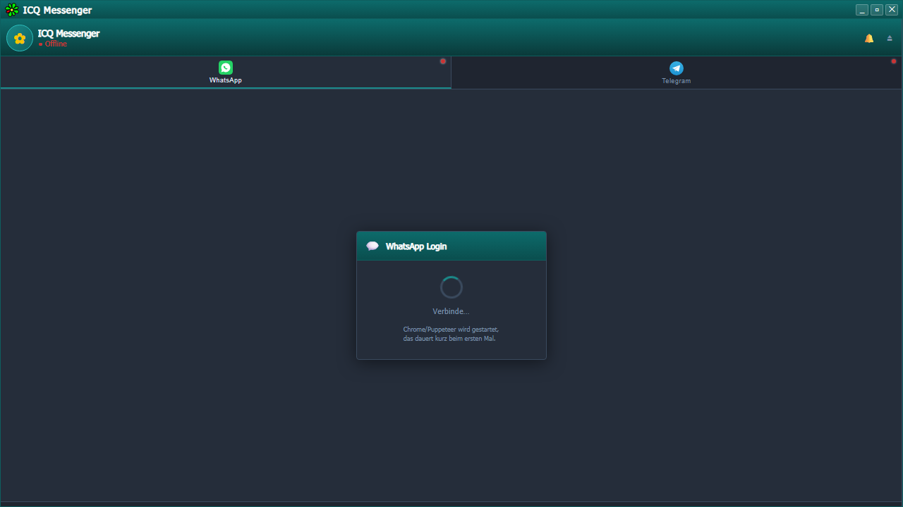

<div align="center">
  
  <h1>ICQ Messenger</h1>
  <p>
    Retro <strong>ICQ 5</strong>-style multi-messenger — built with <strong>Electron + React</strong>.<br/>
    Manage <strong>WhatsApp</strong> and <strong>Telegram</strong> from one classic dark-teal desktop app.
  </p>

  
  
  
  
  

  <br/><br/>

  [](https://github.com/Felix-Helleckes/ICQ/releases/latest)
  [](https://www.youtube.com/@TheEfficientDev)
  [](https://felix-helleckes.github.io/)
</div>

---

## Screenshots

| WhatsApp | Telegram |
|----------|----------|
|  |  |

> *Login screens — no personal data shown. Once connected, the sidebar fills with your contacts sorted by recency.*

---

## Features

| | Feature | Details |
|--|---------|---------|
| 🎨 | **ICQ 5 dark teal skin** | CSS variables, `rem`-based sizing, A−/A+ font controls |
| 💬 | **WhatsApp** | QR login · persistent session · images · videos · GIFs · stickers · read receipts |
| ✈️ | **Telegram** | QR or phone number login · 2FA · photos · videos · GIFs · animated stickers |
| 🪟 | **Separate chat windows** | Each contact gets its own floating window — true ICQ 5 style |
| 🗂️ | **Collapsible groups** | Groups folded away at top · per-service group sound toggle |
| 🖼️ | **Profile pictures** | Background-loaded for contacts + your own profile in the header |
| 🔔 | **Classic ICQ sound** | Global 🔔/🔕 toggle + separate group sound control per service |
| ✓✓ | **Read receipts** | WhatsApp ack states: pending · sent · delivered · read (blue ✓✓) |
| ⌨️ | **Typing indicator** | Animated *tippt…* shown live in the chat header |
| 🔍 | **Media lightbox** | Click any image or video to view fullscreen |
| 🔄 | **Live contact list** | Unread badges · last message preview · auto-sort by recency |
| 📦 | **Portable build** | Single `.exe` — no installation required |

---

## Quick Start

### Requirements

- **Node.js** 18+ (LTS)
- **npm** 9+
- Windows, macOS, or Linux

> On **Linux**, Puppeteer (WhatsApp) needs: `libnss3 libatk-bridge2.0-0 libx11-xcb1 libdrm2 libgbm1 libasound2`

### Install & run

```bash
git clone https://github.com/felix-helleckes/ICQ.git
cd ICQ
npm install
npm start
```

`npm start` launches the React dev server and Electron simultaneously.

---

## Login

### WhatsApp
1. Switch to the **WhatsApp** tab
2. Wait a moment — Puppeteer/Chrome starts in the background
3. Scan the QR code with your phone → **WhatsApp → Linked Devices → Link a Device**
4. Done — session is saved and survives restarts

### Telegram
1. Switch to the **Telegram** tab
2. Choose **QR code** (scan with Telegram mobile) **or** enter your **phone number**
3. Enter the code sent to your phone (+ 2FA password if enabled)
4. Done — session stored in `data/telegram.session`

> No API keys or developer accounts needed for either service.

---

## Build

```bash
# Windows — NSIS installer + Portable
npx electron-builder --win nsis portable

# macOS — DMG (unsigned)
npx electron-builder --mac dmg

# Linux — AppImage + .deb
npx electron-builder --linux AppImage deb
```

Output goes to the `dist/` folder.

---

## Project Structure

```
├── electron/
│   ├── main.js              # Main process · IPC handlers · multi-window management
│   ├── preload.js           # contextBridge — exposes window.api to React
│   ├── whatsapp-bridge.js   # WhatsApp via whatsapp-web.js + Puppeteer
│   └── telegram-bridge.js   # Telegram MTProto via GramJS
├── src/
│   ├── App.js               # Sidebar / contact list window
│   ├── ChatApp.js           # Per-contact chat window
│   ├── index.css            # Global ICQ 5 styles + CSS variables
│   └── components/
│       ├── TitleBar.js      # Frameless title bar (minimize / maximize / close)
│       ├── Sidebar.js       # Service tabs · contact list · groups · sound controls
│       ├── ChatWindow.js    # Messages · emoji picker · media · lightbox · read receipts
│       └── LoginPanel.js    # QR + phone login for both services
├── public/
│   ├── icq-logo.png         # ICQ logo (app icon source)
│   ├── whatsapp-logo.svg    # WhatsApp logo (service tab)
│   ├── telegram-logo.svg    # Telegram logo (service tab)
│   ├── icon.ico             # Generated Windows app icon
│   └── sounds/
│       └── icq-message.mp3  # Classic ICQ notification sound
└── package.json
```

---

## Architecture Notes

- **Multi-window** — each chat is a separate `BrowserWindow`, tracked in a `Map` and reused on re-open
- **Broadcast pattern** — `BrowserWindow.getAllWindows().forEach(w => w.webContents.send(...))` keeps sidebar + chat windows in sync instantly
- **Avatar cache** — avatars cached in main process (`Map`), pushed via `wa:avatar` / `tg:avatar` events, no re-fetching
- **Non-blocking contact list** — `getChats()` / `getDialogs()` return immediately; avatars load in background loops
- **IPC cleanup** — every listener returns a removal function used in `useEffect` — no memory leaks
- **Font scaling** — `html { font-size }` set at runtime, all UI sizes in `rem`
- **BigInt peer IDs** — Telegram IDs converted to `BigInt` before every GramJS API call to prevent silent lookup failures

---

## First-run warnings

**Windows — SmartScreen:** Click **"More info"** → **"Run anyway"**

**macOS — Gatekeeper:** Right-click the `.app` → **"Open"** → **"Open"**  
Or in Terminal: `xattr -cr /Applications/ICQ\ Messenger.app`

